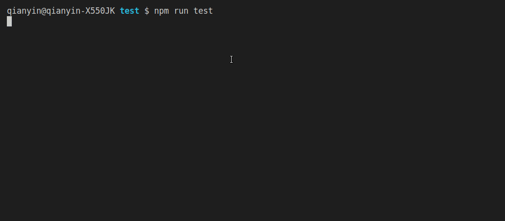
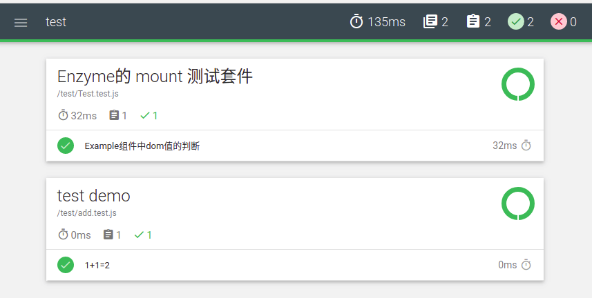

# create-react-app 中配置 mocha

## 一、 创建演示项目

### 1.1 使用 create-react-app 创建应用

```shell
$ create-react-app test
```

### 1.2 整理项目

  删除演示文件（因为这里不需要将应用跑起来所以这里直接清空 src 目录），并在根目录创建 test 目录用于存放我们编写的测试文件, 整理后的目录如下：

```shell
├── package.json
├── package-lock.json
├── public
│   ├── favicon.ico
│   ├── index.html
│   └── manifest.json
├── README.md
├── src
└── test
```

## 二、 配置 mocha 并进行简单测试

### 2.1 安装基本依赖包

```shell
# 安装 mocha
$ npm install mocha -D
# 安装 断言库
$ npm install chai -D
# 安装 mochawesome 用于生成 HTML 报文
$ npm install mochawesome -D
```

##### 2.2 简单编写测试代码并配置脚本命令

- 在项目任意位置编写需要测试的代码

```js
// 待测试代码（你可以在项目内任意位置进行编写）
function add(x,y){
  return x+y
}
module.exports = add;
```
- 在 test 目录下创建 Add.test.js 文件并编写测试代码
```js
// 导入待测试函数 也就是上文的 add 函数
const add = require("../src/util/index");
// 导入断言库
const {expect} = require("chai");
// 编写测试套件（区块）
describe('test demo',function(){
  // 编写测试单元
  it('1+1=2',function(){
    expect(add(1,1)).to.be.equal(2);
  })
})
```
- 配置 pageage.json 中的脚本命令

  实际上下面脚本命令： --reporter test 可以不进行设置在执行 mocha 命令时会默认执行 test 目录下的所有测试代码；
```json
{
  "scripts": {
    "test": "mocha --reporter test --reporter mochawesome",
  },
}
```
- 执行脚本命令查看测试结果
```shell
$ npm run test
```
  @import "./img/Peek 2018-09-10 13-19.gif"
- 执行命令后将会在项目目录下生成目录： ` mochawesome-report `，目录内是导出的测试结果；打开 html 文件即可查看测试结果；

##### 2.3 添加 mocha 配置文件：简化脚本命令
- 在 test 目录下创建配置文件 ` mocha.opts `
- 将脚本命名中的参数命令写入配置文件中
```opts
--reporter mochawesome
```
- 修改脚本命令
```json
{
  "scripts": {
    "test": "mocha",
  },
}
```
- 执行脚本命令 `npm run test` 测试配置文件是否生效

#### 三、 在 react 中配置 mocha
&nbsp;	首先 mocha 默认是不支持 ES6 等高级JS语法，所以若需要使用高级JS语法则要先进行配置 babel ；但是通过 create-react-app 搭建的项目对于 babel 以及 webpack 的配置是隐藏的；直接在项目目录下创建 babel 配置文件 `.babelrc`  并进行配置 babel-preset-es2015 等配置的时候是无法进行生效的（在package.json中进行配置也是一样无法生效）；所以这里我们引入别人封装好的 babel 插件及预设来实现对 babel 的配置；

##### 3.1 配置 babel
- 安装依赖
```shell
$ npm install babel-plugin-transform-es2015-modules-commonjs -D
$ npm install babel-preset-react-app -D
```
- 在 pageage.json 中新增 babel 配置
> 当然这里你可以通过配置文件 .babelrc 进行配置
```json
{
	....
  "babel": {
    "presets": ["react-app"],
    "plugins": ["transform-es2015-modules-commonjs"]
  }
}
```

##### 3.2 配置 enzyme
&nbsp;	Enzyme是 React 的 JavaScript 测试实用程序，可以更容易地断言，操作和遍历 React Components 的输出。Enzyme 模仿了 jQuery 用于 DOM 操作和遍历的 API ，使得 Enzyme 在使用上很是直观和灵活。

- 安装依赖 Enzyme
```shell
$ npm install enzyme -D
```
- 安装 enzyme 还需要根据React的版本安装适配器，适配器对应表如下

  |   nzyme Adapter Package      |   React semver compatibility   |
  | ---------------------------- | ------------------------------ |
  |   enzyme-adapter-react-16     |   ^16.4.0-0                    |
  |   enzyme-adapter-react-16.3   |   ~16.3.0-0   									|
  |   enzyme-adapter-react-16.2   |   ~16.2   											|
  |   enzyme-adapter-react-16.1   |   ~16.0.0-0 \|\| ~16.1   			|
  |   enzyme-adapter-react-15     |   ^15.5.0   										|
  |   enzyme-adapter-react-15.4   |   15.0.0-0 - 15.4.x   					|
  |   enzyme-adapter-react-14     |   ^0.14.0   										|
  |   enzyme-adapter-react-13     |   ^0.13.0   										|


- 安装依赖：enzyme-adapter-react-16， 因为我安装的 react 版本为 ^16.5.0
```shell
$ npm install enzyme-adapter-react-16 -D
```

##### 3.3 安装 jsdom
&nbsp;	enzyme 有三种渲染组件的方式：分别是 shallow 、mount、render；其中 mount 方法的使用需要手动模拟浏览器环境，这时我们则可以使用插件 jsdom 来为我们模拟该浏览器环境；
- 安装依赖：
```shell
$ npm install jsdom -D
```

##### 3.4 安装 ignore-styles
&nbsp;	使用mocha进行测试时，若在react 中引入css，less等样式文件将会报如下错误，通过插件 ignore-styles 即可解决问题；
```text
SyntaxError: F:xxxx/src/source/stylesheets/radio.less: Unexpected token (1:0)
> 1 | .dc-checkbox {
    | ^
  2 |   position: relative;
  3 | }
  4 | .dc-checkbox>label{
```
- 安装依赖
```shell
$ npm install ignore-styles -D
```

##### 3.5 修改 mocha 配置文件 mocha.opts

- --reporter mochawesome 参数命令用于生成 HTML 模板
- --require babel-core/register 参数说明使用 babel 进行编译
- --require ignore-styles 参数将忽略 css 等导入的非 js 文件
- --require ./test/setup.js 设置 mocha 的先行执行的测试文件，mocha 将会优先执行该文件后再执行 test 目录下的其余测试文件；

```opts
--reporter mochawesome
--require babel-core/register
--require ignore-styles
--require ./test/setup.js
```
##### 3.6 修改 package.js 脚本命令

&nbsp;	必需设置 node 的环境变量为 `development`， babel 插件才能生效；

```json
{
  "scripts": {
    "test": "NODE_ENV=development mocha"
  }
}
```
#### 四、针对 React 组件编写简单的测试样例
##### 4.1 编写待测试 react 组件
&nbsp;	在 src 目录下创建 Test 组件, 当然你也可以在任意地方创建你的组件，你只要保证你的组件编写正确即可；
```jsx
import React from 'react';
import './test.css';
export default class extends React.Component{
  render(){
    return (
      <div className="content">
        this is test code!
      </div>
    );
  }
}
```

#### 4.2 编写测试文件 setup.js

&nbsp;	在 test 目录下创建测试文件 setup.js 该文件将模拟一个浏览器环境：因为下面我们将使用 mount 来渲染组件，当然你如果使用的是其他渲染组件的方法可以不需要；
```js
// 模拟浏览器环境
import jsdom from 'jsdom';
const { JSDOM } = jsdom;

if (typeof document === 'undefined') {
    const dom=new JSDOM('<!doctype html><html><head></head><body></body></html>');
    global.window =dom.window;
    global.document = global.window.document;
    global.navigator = global.window.navigator;
}
```
##### 4.3 针对 Test 组件编写测试文件
&nbsp;	在 test 目录内创建测试文件 Test.test.js 来针对组件 Test 编写测试代码
```js
import React from 'react'
import {assert} from 'chai'
import Enzyme from 'enzyme'
import Adapter from 'enzyme-adapter-react-16'
import Test from '../src/Test'

const { mount }=Enzyme

// 为 Enzyme 配置适配器
Enzyme.configure({ adapter: new Adapter() })

describe('Enzyme的 mount 测试套件', function () {
  it('Example组件中dom值的判断', function () {
    // 渲染组件
    let app = mount(<Test />);
    // 查询dom
    const test = app.find('.content');
    // 使用断言判断 dom 值是否等于指定的值
    assert.equal(test.text(),'this is test code!')
  })
})
```
##### 4.4 执行脚本命令：
```shell
$ npm run test
```
&nbsp;	执行 mocha 命令其实他会默认找项目下的 test 目录，并执行内部的所有测试文件，因为我们设置了脚本配置 --require ./test/setup.js 所有它会先行执行测试脚本 setup.js 来模拟一个浏览器的环境 然后执行 test 目录下的所有测试脚本；



##### 4.5 如果你的 react 版本为 15.xx 并且报以下错误：
**错误信息**
```shell
Error: Cannot find module 'react-test-renderer/shallow'
....
```
**解决办法: 安装依赖react-test-renderer**
```shell
$ npm install react-test-renderer -D
```


##### 4.6 最后我们瞄一眼导出的测试报告

