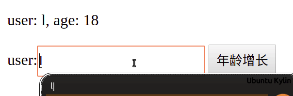
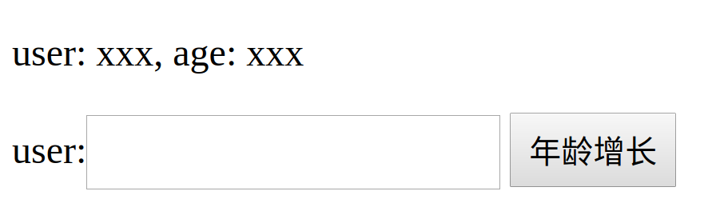
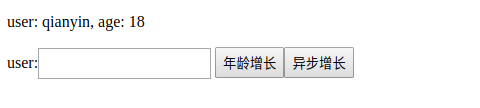
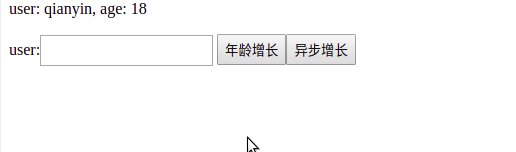

#### 写在前头
> 博客来源

&nbsp;	本篇博客主要是针对前段时间看过的一套关于 react 视频教程中所讲述的有关 redux 原理的知识做了一个简单的整理和归纳并添加了部分个人的理解；

> demo 演示

&nbsp;	本篇博客主要针对下面一个小小 demo 进行一步步阐述 redux 以及 react-redux 的实现原理
  

> 下面是最终整个 demo 的项目结构树

```shell
├── config-overrides.js
├── .gitignore
├── package.json
├── package-lock.json
├── public
│   ├── favicon.ico
│   ├── index.html
│   └── manifest.json
├── README.md
└── src
    ├── App.js
    ├── Demo
    │   ├── actionCreate.js
    │   ├── Demo.jsx
    │   ├── react-redux.js
    │   ├── reducer.js
    │   ├── redux.js
    │   ├── style.css
    │   └── thunk.js
    └── index.js
```
#### 一、 redux API createStore 的实现
&nbsp;	首先我们先结合 reducer 以及 action 的知识简单实现开头展示的 demo, 并逐步揭晓 createStore 的神秘面纱；

##### 1.1 准备工作：  
> 创建 reducer 并导出 reducer

```jsx
// reducer.js
const initState = { user: 'qianyin', age: 18, sex: '男' };
export const reducer = (state=initState, action) => {
  switch(action.type){
    case 'USER_UPDATE':
      return {...state, ...action.payload};
    case 'AGE_GROW':
      return {...state, age: state.age + 1};
    case 'SEX_UPDATE':
      return {...state, ...action.payload};
    default:
      return state;
  }
}
```
> 创建 action 创建函数

```js
// actionCreate.js
export const changeUser = (user) => {
  return {
    payload:{user},
    type: 'USER_UPDATE',
  };
}

export const changeAge = () => {
  return { type: 'AGE_GROW' };
}
```
> 通过 react 在页面上预先绘制出基本的元素
```css
/* style.css */
.btn{
  height: 31px;

}
.input{
  height: 25px;
}
```

```jsx
// Demo.jsx
import React from 'react';
import './style.css';

export default class Demo extends React.Component{
  onChange = () => {}
  onClick = () => {}
  render(){
    return (
      <div>
        <p>user: xxx, age: xxx</p>
        user: 
        <input type="text" className="input" onChange={this.onChange}/>
        &nbsp;
        <button className="btn" onClick={this.onClick}>年龄增长</button>
      </div>
    );
  }
}
```

> 最终页面将渲染如下：



##### 1.2 demo 的初次实现代码
- 创建全局状态 state；
- 创建监听队列；
- 针对监听队列，新增函数用于将指定监听对象添加到队列中；
- 在函数 dispatch 中执行 reducer 将返回值作为新的 state, 同时依次执行监听对象；
- 默认执行一次 dispatch 给定一个 type 相对唯一的 action， 目的是为了匹配 reducer 的默认状态值，从而实现对 redux state 的初始化；
- 在组件 Demo 通过在函数 update 使用 this.setState 将全局 state 保存到 react state 中，并将函数 update 添加到监听队列中；从而使得当我们一旦试图通过 dispatch 修改全局状态时，能够及时更新 react state 最终触发 react 生命周期 render；
- 在 react 生命周期 componentDidMount 中我们除了将 update 添加到监听队列以外，还需手动执行一次 update 其主要目的就是为了首次初始化 react state;

```jsx
// Demo.jsx
import React from 'react';
import { changeAge, changeUser } from './actionCreate';
import { reducer } from './reducer';
import './style.css';

let state;
const listeners = [];
const subscribe = (listener) => {
  listeners.push(listener);
}
const dispatch = (action) => {
  state = reducer(state, action);
  console.log(state);
  listeners.forEach(v => v());
}
dispatch({type: '%$&HJKAJJHDJHJ'});

export default class Demo extends React.Component{
  state = {user: 'xxx', age: 'xxx'};
  componentDidMount(){
    subscribe(this.update);
    this.update();
  }

  update = () => {
    this.setState(state);
  }

  onChange = (e) => {
    dispatch(changeUser(e.target.value));
  }

  onClick = () => {
    dispatch(changeAge());
  }

  render(){
    return (
      <div>
        <p>user: {this.state.user}, age: {this.state.age}</p>
        user: 
        <input type="text" className="input" onChange={this.onChange}/>
        &nbsp;
        <button className="btn" onClick={this.onClick}>年龄增长</button>
      </div>
    );
  }
}
```
##### 1.3 API createStore 的实现
&nbsp;	其实上文的代码中对于 createStore 的实现原理已经基本描述清除，下面我们只是单纯的对代码进行了简单的封装；当然为了能够获取到 state 我们专门增加了一个函数 getState 来实现它；

> createStore 函数实现

```jsx
// redux.js

export const createStore = (reducer) => {
  // 声明常量
  let state;
  const listeners = [];

  // 获取状态
  const getState = () => {
    return state;
  }

  // 添加监听对象
  const subscribe = (listener) => {
    listeners.push(listener);
  }

  // [1]执行reducer修改状态 [2]遍历执行监听对象
  const dispatch = (action) => {
    state = reducer(state, action);
    listeners.forEach(v => v());
  }

  // 初始化 state
  dispatch({type: '%$&HJKAJJHDJHJ'});
	
  // 暴露接口
  return {getState, subscribe, dispatch};
}
```
> 调用 createStore 并对 demo 进行修改

```jsx
// Demo.jsx
import React from 'react';
import './style.css';
import { changeAge, changeUser } from './actionCreate';
import { reducer } from './reducer';
import { createStore } from './redux';

const store = createStore(reducer);

export default class Demo extends React.Component{
  state = {user: 'xxx', age: 'xxx'};
  componentDidMount(){
    store.subscribe(this.update);
    this.update();
  }

  update = () => {
    this.setState(store.getState());
  }

  onChange = (e) => {
    store.dispatch(changeUser(e.target.value));
  }

  onClick = () => {
    store.dispatch(changeAge());
  }

  render(){
    return (
      <div>
        <p>user: {this.state.user}, age: {this.state.age}</p>
        user: 
        <input type="text" className="input" onChange={this.onChange}/>
        &nbsp;
        <button className="btn" onClick={this.onClick}>年龄增长</button>
      </div>
    );
  }
}
```
#### 二、 react-redux API Provider 的实现
&nbsp;	在 react 中大多数情况下我们需要将状态传递给后代组件进行使用的，当然通过 props 是可以实现状态从父级到子级的传递，但是当状态需要传递的层级比较深的情况下再使用 props 就显得无力了，那么在 react-redux 中它是如何实现对 store 的传递的呢？ 
#####  2.1 react context 的引入
> 在 App.js 中创建 store 并通过 context 传递 store
```jsx
// App.js
import React, { Component } from 'react';
import propTypes from 'prop-types';
import { createStore } from './Demo/redux';
import { reducer } from './Demo/reducer';
import Demo from './Demo/Demo';

// 创建 store
const store = createStore(reducer);

class App extends Component {
  // 声明 childContextTypes 状态属性类型
  static childContextTypes = {
    store: propTypes.object
  };
  // 设置 childContext
  getChildContext(){
    return {store}
  }
  render() {
    return <Demo />;
  }
}
export default App;
```
> 在子组件 Demo 中通过 context 获取 store 并对代码进行简单修改
```jsx
// Demo.jsx
import React from 'react';
import propTypes from 'prop-types';
import './style.css';
import { changeAge, changeUser } from './actionCreate';

export default class Demo extends React.Component{
  // 设置 context 状态值类型
  static contextTypes = {
    store: propTypes.object
  };

  constructor(props, context){
    super(props, context);
    // 获取store
    this.store = context.store;
    this.state = {user: 'xxx', age: 'xxx'};
  }
  
  componentDidMount(){
    this.store.subscribe(this.update);
    this.update();
  }

  update = () => {
    this.setState(this.store.getState());
  }

  onChange = (e) => {
    this.store.dispatch(changeUser(e.target.value));
  }

  onClick = () => {
    this.store.dispatch(changeAge());
  }

  render(){
    return (
      <div>
        <p>user: {this.state.user}, age: {this.state.age}</p>
        user: 
        <input type="text" className="input" onChange={this.onChange}/>
        &nbsp;
        <button className="btn" onClick={this.onClick}>年龄增长</button>
      </div>
    );
  }
}
```
##### 2.2 封装代码实现 Provider
&nbsp;	通过 react context 我们实现了对 store 的传递，到这里 Provider 的功能以及实现原理基本上应该算是清晰了，无非就是对组件进行包裹同时通过 react context 来传递共享 store；那么接下来我们通过对代码的封装来实现 Provider 组件；

> Provider 组件：实现对 store 的传递
```jsx
// react-redux.js
import React from 'react';
import propTypes from 'prop-types';

export class Provider extends React.Component{
  // 设置 childContext 状态值类型
  static childContextTypes = {
    store: propTypes.object
  };

  // 设置 childContext
  getChildContext(){
    return {store: this.props.store}
  }
  
  render(){
    return this.props.children;
  }
}
```
> 重写 App.js： 对 Provider 组件的调用
```jsx
// App.js
import React, { Component } from 'react';
import { createStore } from './Demo/redux';
import { Provider } from './Demo/react-redux';
import { reducer } from './Demo/reducer';
import Demo from './Demo/Demo';

// 创建 store
const store = createStore(reducer);

class App extends Component {
  render() {
    // 调用接口 Provider
    return <Provider store={store}><Demo /></Provider>;
  }
}
export default App;
```
#### 三、 react-redux API connect 高阶组件的实现
&nbsp;	上文中在后代组件如果需要获取 store 则需要手动通过获取 react context 来调用 store 并且需要显性的调用 store 内部的方法来进行一些操作；接下来我们来实现这么一个高阶组件 connect，我们只需要提供所需的 redux state 以及 action 创建函数，即可通过 props 获取到相应的 redux state , 并且允许直接通过 props 调用action 创建函数来试图修改 redux state ；

> 创建高阶组件 connect 
```jsx
// react-redux.js
export const connect = (mapStateToProps, mapDispatchToProps) => (Component) => {
  return class NewComponent extends React.Component{
    render(){
      return <Component />
    }
  }
}
```
> 获取store
```jsx
// react-redux.js
export const connect = (mapStateToProps, mapDispatchToProps) => (Component) => {
  return class NewComponent extends React.Component{
    // 设置 context 状态值类型
    static contextType = {
      store: propTypes.object
    };
  	// [1]获取 store [2]设置空 react state
    constructor(props, context){
      super(props, context);
      this.store = context.store;
      this.state = {};
    }
    render(){
      return <Component />
    }
  }
}
```
> 添加监听对象，并尝试通过 props 将状态传递给子组件
```jsx
export const connect = (mapStateToProps, mapDispatchToProps) => (Component) => {
  return class NewComponent extends React.Component{
    static contextType = {
      store: propTypes.object
    };
    constructor(props, context){
      super(props, context);
      this.store = context.store;
      this.state = {};
    }
  	// [1]添加监听对象 [2]手动执行监听对象，初始化 react state
    componentDidMount(){
      this.store.subscribe(this.update);
      this.update();
    }
  
    update = () => {
      // 获取全部redux state 并添加到 react state
      const state = this.store.getState();
      this.setState(state);
    }
    render(){
      // 通过 props 将 react state 全部传给子组件
      return <Component {...this.state} />
    }
  }
}
```
> 通过 mapStateToProps 获取指定 redux state
```jsx
// react-redux.js
export const connect = (mapStateToProps, mapDispatchToProps) => (Component) => {
  return class NewComponent extends React.Component{
    static contextType = {
      store: propTypes.object
    };
    constructor(props, context){
      super(props, context);
      this.store = context.store;
      this.state = {};
    }
    componentDidMount(){
      this.store.subscribe(this.update);
      this.update();
    }
  
    update = () => {
      // 执行 mapStateToProps 只获取用户指定需求的 state
      const state = this.store.getState();
      const filterState = mapStateToProps(state);
      this.setState(filterState);
    }
    render(){
      return <Component {...this.state} />
    }
  }
}
```
> 通过 mapDispatchToProps 获取 action 创建函数： 使用 dispatch 包裹后返回
```jsx
// react-redux.js
// react-redux.js
export const connect = (mapStateToProps, mapDispatchToProps) => (Component) => {
  return class NewComponent extends React.Component{
    static contextTypes = {
      store: propTypes.object
    };
    constructor(props, context){
      super(props, context);
      this.store = context.store;
      this.state = {};
    }
    componentDidMount(){
      this.store.subscribe(this.update);
      this.update();
    }
  
    update = () => {
      // 处理 state ===> 获取用户指定的 state
      const state = this.store.getState();
      const filterState = mapStateToProps(state);

      // 使用 dispatch 对 mapDispatchToProps 中的 action 创建函数进行包裹后返回
      const actionFun = {};
      for(let key in mapDispatchToProps){
        actionFun[key] = (...args) => {
          this.store.dispatch(mapDispatchToProps[key](...args));
        }
      }
  // 一种简写方式： 骚操作
  // const actionFun = Object.keys(mapDispatchToProps)
  //  .reduce((total, item) => {
  //    return { ...total, [item]: (...args) => {dispatch(mapDispatchToProps[item](...args));}
  //   } } ,{});

      this.setState({...filterState, ...actionFun});
    }
    render(){
      return <Component {...this.state} />
    }
  }
}
```

> 调用高阶组件：修改 Demo.jsx
```jsx
// Demo.jsx
import React from 'react';
import { changeAge, changeUser } from './actionCreate';
import { connect } from './react-redux';
import './style.css';

// 编写 mapStateToProps 参数 redux state 返回所需的 redux state
const mapStateToProps = (state) => {
  return {user: state.user, age: state.age};
}

// 调用高阶组件
@connect(mapStateToProps, {changeAge, changeUser})
export default class Demo extends React.Component{
  onChange = (e) => {
    this.props.changeUser(e.target.value);
  }
  onClick = () => {
    this.props.changeAge();
  }
  render(){
    return (
      <div>
        <p>user: {this.props.user}, age: {this.props.age}</p>
        user: 
        <input type="text" className="input" onChange={this.onChange}/>
        &nbsp;
        <button className="btn" onClick={this.onClick}>年龄增长</button>
      </div>
    );
  }
}
```
#### 四、redux API bindactioncreators 的实现
&nbsp;	在上文我们对 mapDispatchToProps 的处理过程就是 API bindactioncreators 的功能： 将给定 action 创建函数使用 dispatch 进行包裹后返回；
> 封装 bindactioncreators
```jsx
// redux.js
export const bindactioncreators = (mapDispatchToProps, dispatch) => {
  const actionFun = {};
  // 遍历 mapDispatchToProps 中每个 action 创建函数 并使用 dispatch 包裹后返回
  for(let key in mapDispatchToProps){
    actionFun[key] = (...args) => {
      dispatch(mapDispatchToProps[key](...args));
    }
  }

  return actionFun;
  // 一种简写方式： 骚操作
  // return actionFun = Object.keys(mapDispatchToProps)
  //  .reduce((total, item) => {
  //    return { ...total, [item]: (...args) => {dispatch(mapDispatchToProps[item](...args));}
  //   } } ,{});
}
```
> 修改 connect ： 
```jsx
// react-redux.js
import { bindactioncreators } from './redux';
....
export const connect = (mapStateToProps, mapDispatchToProps) => (Component) => {
  return class NewComponent extends React.Component{
    static contextTypes = {
      store: propTypes.object
    };
    constructor(props, context){
      super(props, context);
      this.store = context.store;
      this.state = {};
    }
    componentDidMount(){
      this.store.subscribe(this.update);
      this.update();
    }
  
    update = () => {
      const state = this.store.getState();
      const filterState = mapStateToProps(state);
      
      // 调用 API bindactioncreators 
      // 对 mapDispatchToProps 内每个 action 创建函数使用 dispatch 进行包裹后返回
      const actionFun = bindactioncreators(mapDispatchToProps, this.store.dispatch);
      this.setState({...filterState, ...actionFun});
    }
    render(){
      return <Component {...this.state} />
    }
  }
}
```
#### 五、redux API applyMiddleware 的实现
&nbsp;	到此简化版的 react-redux 算是已经初步完成，但是假如我们想要我们的 age 值的增长是一个异步操作，比如：通过按钮点击后经过两秒再修改 age ，而不是一点击按钮就立即修改值；这样我们又该怎么实现呢？
&nbsp;	当然我们可以通过 setTimeout 两秒后再执行 action 创建函数，比如这样：
```jsx
onClick = () => {
  setTimeout(()=>{
  	// 两秒后执行 action 创建函数
  	this.props.changeAge();
  }, 2000);
}
```
&nbsp;	但是呢事实上我们并不愿意像上面那么整，我们想要这么一种效果：我们只需要简单的调用 action 创建函数即可实现异步操作，而不是需要进行额外的操作；这时我们就需要为我们的 react-redux 编写一个中间件来实现这么一个效果；
##### 5.1 准备工作
> 新增action 创建函数

&nbsp;	在这之前我们所有的 acton 创建函数都是直接返回一个 action 对象，下面我们写一个不一样的 action 创建函数， 它返回的不再是一个 action 对象而是一个函数，并且该函数接收两个参数 dispatch 以及 getState， 在该函数内部我们进行相应的异步操作，比如：修改 age 值；
```js
// actionCreate.js
export const asyncChangeAge = () => {
  // 返回函数
  return (dispatch, getState) => {
    setTimeout(v=>{
      console.log('==>', getState());
      dispatch({type: 'AGE_GROW'});
    }, 1000);
  }
}
```
> 修改页面：新增按钮并绑定点击事件，并且调用 asyncChangeAge 函数；
```jsx
// Demo.jsx
// Demo.jsx
import React from 'react';
import './style.css';
// 导入 asyncChangeAge
import { changeAge, changeUser, asyncChangeAge } from './actionCreate';
import { connect } from './react-redux';

const mapStateToProps = (state) => {
  return {user: state.user, age: state.age};
}

// 添加 asyncChangeAge
@connect(mapStateToProps, {changeAge, changeUser, asyncChangeAge})
export default class Demo extends React.Component{
  onChange = (e) => {
    this.props.changeUser(e.target.value);
  }
  onClick = () => {
      this.props.changeAge();
  }
  // 点击事件
  onClickAsync = () => {
    this.props.asyncChangeAge();
  }
  render(){
    return (
      <div>
        <p>user: {this.props.user}, age: {this.props.age}</p>
        user: 
        <input type="text" className="input" onChange={this.onChange}/>
        &nbsp;
        <button className="btn" onClick={this.onClick}>年龄增长</button>
        {/* 新增按钮 */}
        <button className="btn" onClick={this.onClickAsync}>
        	异步增长
        </button>
      </div>
    );
  }
}
```
> 页面的变化其实很简单就是新增了一个按钮：



##### 5.2 需求实现
&nbsp;	接下来我们先什么都不考虑先来实现我们的需求，现在 action 创建函数 asyncChangeAge  因为返回的是一个对象，其 type 值为 undefined 所以当我们点击按钮时 reducer 将会一直匹配到默认情况，返回的将是当前的状态，接下来我们先让我们的  action 创建函数 asyncChangeAge 生效，达到异步修改状态的作用；

> 扩展 createStore 

&nbsp;	既然 asyncChangeAge 返回的不再是一个 action 对象，而是一个函数；那么其实我们要做的事情是很简单的，我们只需要针对 createStore 中的返回值 dispatch 进行一个简单的扩展即可；通过判断 dispatch 中的 action 参数是否是函数而进行不同的操作：
```jsx
// redux.js
export const createStore = (reducer) => {
	......
	// 在createStore 我们对返回值 dispatch 进行了封装
  const dispatchExtend = (action) => {
    if(typeof action === 'function'){
      // action 为函数，执行函数
      action(dispatch, getState);
    } else {
      // action 为非函数（对象）调用dispatch
      dispatch(action);
    }
  }
  return {getState, dispatch: dispatchExtend, subscribe};
}
```

##### 5.3 抽离封装
&nbsp;	上文我们通过对 createStore 的返回值 dispatch 进行了扩展，实现了 redux-react 的异步操作，但问题是我们将代码写死在 createStore 中了，redux-react 的异步操作应该是一个可选项而不应该是必选项；

> 重新扩展 createStore ： 

&nbsp;	新增参数 middleware （函数）， 在函数 createStore 开始位置判断 middleware 是否存在，存在则执行；
```js
// redux.js
export const createStore = (reducer, middleware) => {
	// 判断 middleware 是否存在，存在则执行
  if(middleware){
    return middleware(createStore)(reducer);
  }

  let state;
  const listeners = [];

  const getState = () => {
    return state;
  }

  const dispatch = (action) => {
    state = reducer(state, action);
    listeners.forEach(v => v());
  }

  const subscribe = (listener) => {
    listeners.push(listener);
  }

  dispatch({type: '%$&HJKAJJHDJHJ'});

  return {getState, dispatch, subscribe};
}

```

> 编写函数 applyMiddleware ，在创建 store 时 作为 createStore 第二参数
```jsx
// App.js
const applyMiddleware = (createStore) => (redux)=> {
  // 在这里进行创建 store
  const store = createStore(redux);
  // 返回store
  return {...store}
}

const store = createStore(reducer, applyMiddleware);
```
> 在 applyMiddleware 函数内扩展 dispatch

&nbsp;	上文 applyMiddleware 函数并其实没做任何事情， 只是在 createStore 函数外面套了一层函数，那么接下来我们做点正事，来扩展一下我们的 dispatch
```jsx
// App.js
const applyMiddleware = (createStore) => (redux)=> {
  const store = createStore(redux);

  const midApi = {
    getState: store.getState,
    dispatch: (...args) => {dispatch(...args);}
  };

  const dispatch = (action) => {
    if( typeof action === 'function' ){
      action(midApi.dispatch, midApi.getState);
    } else {
      store.dispatch(action);
    }
  }

  return {
    ...store,
    dispatch
  };
}
```
> 现在我们来看看效果：



##### 5.4 扩展分离
&nbsp;	上文已经实现了我们想要的效果了，我们在 applyMiddleware 对 dispatch 进行了扩展；然而我们是那么容易满足的嘛，当然不是的！！ applyMiddleware 中对 dispatch 的扩展我们还可以将其单独提出来封装成一个函数；
> 重写 applyMiddleware ，再给 applyMiddleware 包裹一层函数： 将对 dispatch 的扩展抽离，封装成方法；
```jsx
// App.js
const applyMiddleware = (middleware) => (createStore) => (redux)=> {
  const store = createStore(redux);

  const midApi = {
    getState: store.getState,
    dispatch: (...args) => {dispatch(...args);}
  };

  const dispatch = middleware(midApi)(store.dispatch);

  return {
    ...store,
    dispatch
  };
}
```
> thunk 中间件： 其实 thunk 才是真正的中间件；applyMiddleware 只是用来绑定中间件的
```jsx
// App.js 
const thunk = ({dispatch, getState}) => next => (action) => {
  if(typeof action === 'function'){
    action(dispatch, getState);
  } else {
    next(action);
  }
}; 
```
> 在调用 createStore 时绑定中间件 thunk
```jsx
// App.jsx
const store = createStore(reducer, applyMiddleware(thunk));
```

##### 5.5 代码整理
&nbsp;	这一步只是将 applyMiddleware 函数移到 redux.js 文件中；同时将 thunk 函数写到文件 thunk.jsx 中，然后在 App.js 中引用 applyMiddleware 以及 thunk 而已；
> 看下最终效果（效果和上一个录屏是一样样的）


