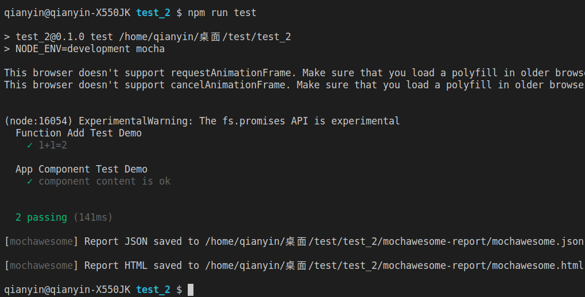
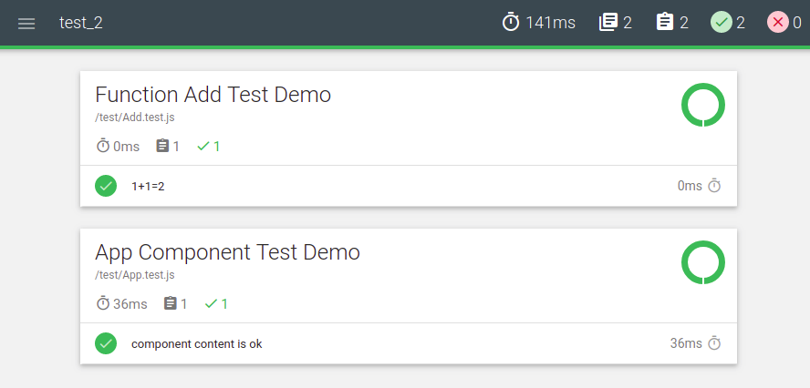

#### 一、快速搭建项目
##### 1.1 借用 create-react-app 搭建应用
```shell
$ create-react-app demo
```
##### 1.2 整理项目
&nbsp;	清除演示文件，这里直接将 src 给清空；因为这里并不需要启动 react 项目；整理后项目结构如下：

##### 1.3 安装依赖
```shell
+ chai@4.1.2
+ mochawesome@3.0.3
+ mocha@5.2.0

+ babel-plugin-transform-es2015-modules-commonjs@6.26.2
+ babel-preset-react-app@3.1.2

+ jsdom@12.0.0
+ ignore-styles@5.0.1
+ enzyme@3.6.0
+ enzyme-adapter-react-16@1.5.0
```
#### 1.4 配置 pageage.json
- 配置 babel
- 修改脚本
```json
{
  "scripts": {
    "test": "NODE_ENV=development mocha"
  },
  "babel":{
    "presets": ["react-app"],
    "plugins": ["transform-es2015-modules-commonjs"]
  }
}
```
##### 1.5 添加 mocha.opts 配置
```opts
--reporter mochawesome
--require babel-core/register
--require ignore-styles
--require ./test/setup.js
```
##### 1.6 测试
- 在 src 目录下创建 add.js 编写待测试代码：对 JavaScript 进行测试
```js
export const add = (a, b) => {
  return a + b;
}
```
- 在 src 目录下创建 App.jsx 编写待测试代码：对 react 组件进行测试
```jsx
import React from 'react';
export default class App extends React.Component{
  render(){
    return (
      <div className="content">
        this is app Component!
      </div>
    );
  }
}
```

- 在 test 目录下创建初始测试执行文件 setup.js 目录：为下面的测试模拟一个浏览器环境
```js
import { JSDOM } from 'jsdom';
if( typeof document === 'undefined' ){
  const dom = new JSDOM('<!doctype html><html><head></head><body></body></html>');
  global.window = dom.window;
  global.document = global.window.document;
  global.navigator = global.window.navigator;
}
```

- 在 test 目录下创建 Add.test.js 测试文件：针对 JavaScript 函数 add 进行测试

```js
import { add } from '../src/add';
import { expect } from 'chai';
describe('Function Add Test Demo', () => {
  it('1+1=2', () => {
    expect(add(1,1)).to.be.equal(2);
  });
});
```

- 在 test 目录下创建 App.test.js 测试文件：针对 react 组件 App 进行测试

```js
import React from 'react';
import { assert } from 'chai';
import Enzyme, {mount} from 'enzyme';
import Adapter from 'enzyme-adapter-react-16';
import App from '../src/App';
Enzyme.configure({adapter: new Adapter()});
describe('App Component Test Demo', () => {
  it('component content is ok', () => {
    const component = mount(<App />);
    const dom = component.find('.content');
    const test = dom.text();
    assert.equal(test, 'this is app Component!');
  });
});
```

- 执行脚本命令
```shell
$ npm run test
```

- 命令行输出：



- HTML模板输出:



#### 二、代码覆盖率
##### 2.1 安装依赖
```shell
npm install babel-cli istanbul -D
npm install babel-istanbul -D
```
##### 2.2  修改脚本
```json
{
  "test": "NODE_ENV=development node_modules/.bin/babel-node ./node_modules/.bin/babel-istanbul cover _mocha",
}
```

#### 三、 Sinon
##### 3.1 安装依赖：
```shell
npm install sinon -D
```
