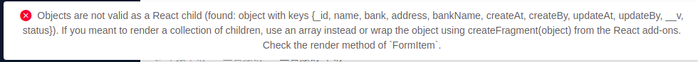
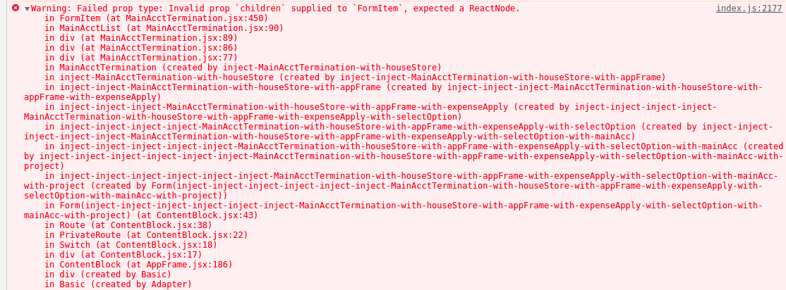

#### 获取数组中指定\_id的数据的索引
```js
nodes && nodes.length && nodes.map((item, index)=>{
if(item._id === curNode._id){return index;}
}).filter((item)=>{return item;})[0]

```


#### 预售房报如下错误：


- 问题：在某一节点我们错误的将一个数据对象作为值进行显示，react默认将该对象作为reactNode元素进行处理，然而该对象只是一个普通的数据对象 并非标准的reactNode元素；所以自然就报错了
- 解决：实际上我们真实要展示的只是对象中的某个字符串数据，所以解决办法自然就是将值真确的展示出来

#### 一些想法
---
##### 一个小体验
```js
// 有数据如下
const data = [
  {title: '', id: ''},
  {title: '', id: ''},
  {title: '', id: ''},
];
```
```js
// 遍历数据创建操作组， 对于每个操作组都应该给其对应要操作的数据项
const setting = getSetting();
data.map((item, index) => {
  <div>
    ...
		{setting.addBtn(item)}
		{setting.editBtn(item)}
		{setting.deleteBtn(item)}
    ...
  </div>
})

```

```js
// 配置[按钮]
// 智能按钮小组件：应当传入要处理的对象数据 以及回调函数即可
// 理想中感觉应该是这样  在全局中具有这么一组只能组件按钮，在任意地方调用并传入当按钮被触发后
// 将要处理的数据对象以及相应的回调函数(可选 当数据处理完执行)
getSetting = () => {
  const { onDelete, openDialog } = this.props;
  return {
    addBtn(item){
      return (
        <span className="font-blue pointer"
        	onClick={openDialog.bind(this, 'createRole', item)}>
        	<Icon type="plus"/>
        </span>
      )
    },
    editBtn(item){
      return (
        <span style={{float: 'right'}}
        	onClick={openDialog.bind(this, 'editRole', item)} 
        	className="font-blue pointer">
        	<Icon type="edit" />
        </span>
      )
    },
    deleteBtn(item){
      return (
        <Popconfirm title="确认要删除?" onConfirm={onDelete.bind(this, item)}>
        	<span style={{float: 'right'}}
       			className="font-red pointer">
        		<Icon type="delete" />
        	</span>
        </Popconfirm>
      )
  	},
} }
```
#### antd 对于一般input等组件当value为null时将显示placeholder属性值，但是对于select组件则不同 当value值为nul时并不会显示placeholder值 只有在value为undefined时才会显示placeholder的值  input等其他组件当value为undefined时同样会先placeholder的值 所以最佳实践即统一使用 undefined
```jsx
<FormItem label="...." {...FormItemLayout}>
  {getFieldDecorator('bank', {
    rules: [{required: true, message: '....'}],
    	initialValue: type === 'edit' ? currBank.bank : undefined,
    })(
    <Select placeholder=".....">
      {options.selectOpts.bankList}
    </Select>
  )}
</FormItem>

```


