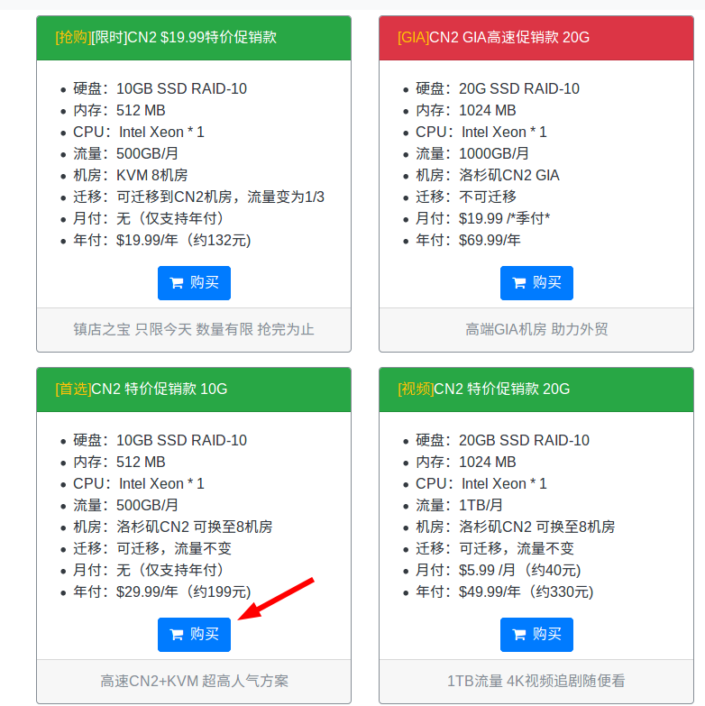
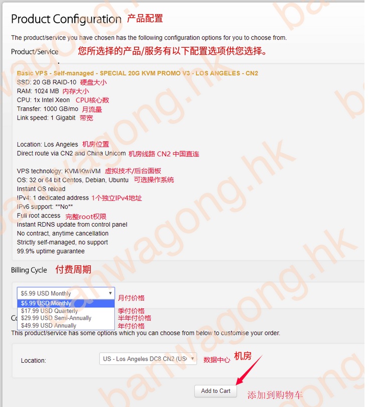
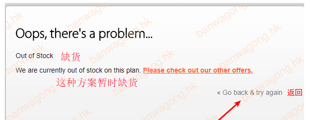
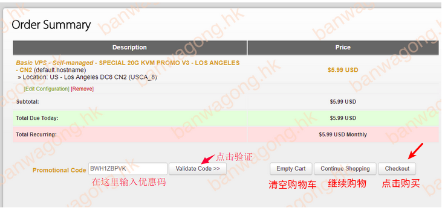
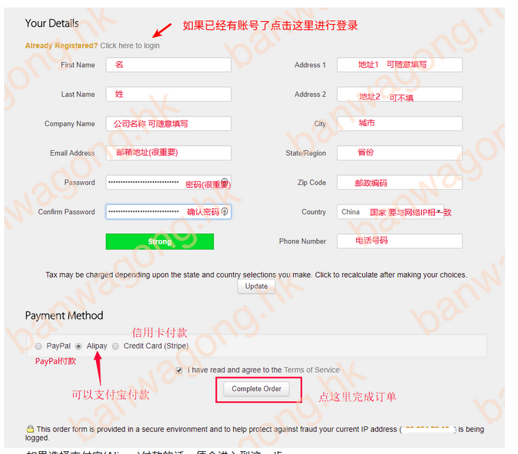

#### 一、 购买国外服务器
##### 1.1 访问搬瓦工VPS中文网站：https://buy.shangyufeidi.com/bwg/ 选择中意的服务器点击购买；

##### 1.2 查看产品配置选择付款周期以及机房将产品添加至购物车

##### 1.2.1 [BUG] 如果点击添加购物车后显示out of stock，说明该种方案的VPS暂时缺货。

##### 1.3 可通过首页获取优惠码,点击验证 ==> 选择购买

##### 1.4 填写账户信息(注册新账号)同时选择支付方式进行购买


产品配置
您所选择的产品/服务有以下配置选项供您选择。
https://buy.shangyufeidi.com/bwg/buy.html?coupon=BWH1ZBPVK


#### 梯子搭建：shadowsocks 服务端安装
- http://shadowsocks.org/en/download/servers.html 多种安装方式
- gpytnon:
```shell
# 1[python]
$ python --version
Python 2.6.8
# 2[pypi]
$ pip install shadowsocks
# 3[github]
$ git clone https://github.com/shadowsocks/shadowsocks.git
$ cd shadowsocks
$ python setup.py
```
### 炸鸡

- 启动shadowsocks服务：service shadowsocks start 或 sslocal -c ss配置文件目录
- ssh -p 27731 root@95.169.6.242